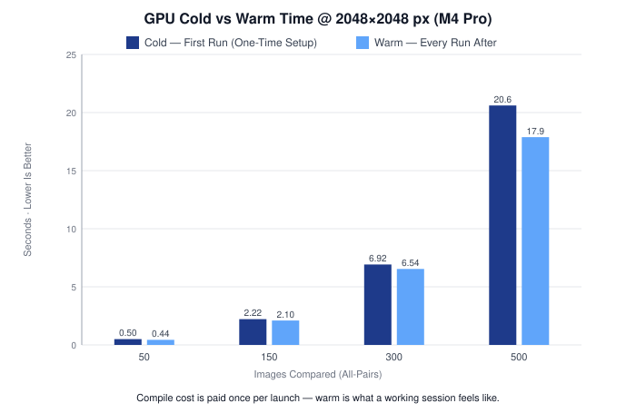

# ImgLabs — ZNCC Performance Benchmarks

How the GPU similarity-matrix pipeline performs against a CPU reference, and how a series of GPU optimizations moved those numbers. Measured with the in-app `PerformanceBenchmark` (best of 3 timed passes; process `phys_footprint` for memory).

## Test machine

| | |
| --- | --- |
| Chip | Apple **M4 Pro** — 14-core CPU, 20-core GPU |
| Memory | **48 GB** unified |
| OS / build | macOS 26.2 |
| Workload | All-pairs ZNCC similarity matrix (`N·(N+1)/2` pairs) over `N` images at a fixed canvas size |
| Test images | Sony **ARW RAW** files from a high-resolution camera — real pro-camera output (not synthetic), so this reflects a demanding, above-average real-world import |
| Baselines | Same computation on a single-threaded CPU reference and a 14-thread (`DispatchQueue.concurrentPerform`) reference |

> Numbers are single-machine, best-of-3. "Warm" = pipeline states already compiled; "cold" = first run including compilation and setup.
>
> The RAW files are decoded and resampled to the canvas size before comparison, so the *compute* time and memory scale with the canvas, not the full-resolution source — but using genuine high-res RAW makes this a heavier-than-typical set (large decode + import) rather than a toy benchmark.

---

## The Optimization Approach

Four changes were made to the GPU pipeline, in order. Each row cites the measurement captured at that stage (these are spot checks taken during development, not one controlled sweep — matched workloads are called out below).

| Stage | Change | What it removed |
| --- | --- | --- |
| **0 — Baseline** | One `DotProduct` kernel per pair; every stage downloaded its result to a host `[Float]` and the next stage re-uploaded it | — |
| **1 — Batched dot product** | A single `batchedDotArr` dispatch (one threadgroup per pair, no atomics) replaces `N·(N+1)/2` kernels | ~20k kernels / encoders / result buffers / observers |
| **2 — Resident `DeviceBuffer`** | Array kernels publish a `DeviceBuffer` observer instead of a `[Float]`; the next factory reads it directly | Every GPU→CPU→GPU round-trip and the duplicate `[Float]` of each intermediate |
| **3 — Early release** | Spent intermediates (grayscale, then the squared arrays) are dropped at each stage boundary | The dot stage no longer holds grayscale + squared buffers |

**Matched before/after (same workload, 2048×2048 px):**

| Workload | Metric | Earlier stage | After items 1–3 | Improvement |
| --- | --- | --- | --- | --- |
| 50 images | warm time | 1.38 s *(stage 0)* | **0.44 s** | 3.1× faster |
| 50 images | peak memory | 9.43 GB *(stage 0)* | **4.91 GB** | 1.9× less |
| 300 images | warm time | 26.09 s *(stage 1)* | **6.54 s** | 4.0× faster |
| 300 images | peak memory | 54.15 GB *(stage 1)* | **26.03 GB** | 2.1× less |

The 300-image case is the clearest story: at stage 1 its 54 GB peak exceeded the 48 GB of RAM (swapping, which is why the time was so high); items 2–3 cut that to 26 GB and the time fell 4×.

---

## Current Results (after items 1–2)

### 2048×2048 px

| Images | GPU cold | GPU warm | CPU 1-thread | CPU 14-thread | GPU peak | CPU peak | Warm speedup vs 14-core |
| ---: | ---: | ---: | ---: | ---: | ---: | ---: | ---: |
| 50 | 0.50 s | 0.44 s | 2.59 s | 0.29 s | 4.91 GB | 4.36 GB | 0.67× |
| 150 | 2.22 s | 2.10 s | 23.06 s | 2.31 s | 13.30 GB | 6.17 GB | **1.10×** |
| 300 | 6.92 s | 6.54 s | 91.96 s | 8.99 s | 26.03 GB | 11.82 GB | **1.37×** |
| 500 | 20.61 s | 17.88 s | 255.15 s | 24.64 s | 43.10 GB | 19.40 GB | **1.38×** |

### 512×512 px

| Images | GPU cold | GPU warm | CPU 1-thread | CPU 14-thread | GPU peak | CPU peak | Warm speedup vs 14-core |
| ---: | ---: | ---: | ---: | ---: | ---: | ---: | ---: |
| 50 | 0.12 s | 0.07 s | 0.16 s | 0.02 s | 630 MB | 580 MB | 0.26× |
| 150 | 0.30 s | 0.24 s | 1.44 s | 0.14 s | 1.20 GB | 1.12 GB | 0.59× |
| 300 | 0.74 s | 0.63 s | 5.73 s | 0.55 s | 2.11 GB | 1.82 GB | 0.88× |
| 500 | 1.51 s | 1.42 s | 15.92 s | 1.54 s | 3.44 GB | 1.89 GB | **1.08×** |

### Cold vs Warm

**Cold** is the *first* analysis after launch — it includes compiling the Metal pipeline states and the first-touch buffer allocation. The app builds a single `MetalComputeContext` and reuses it, so those pipelines compile **once per app launch**. **Warm** is every analysis after that.

The gap is small and mostly a fixed setup cost: 500 images at 2048 px is 20.6 s cold vs 17.9 s warm. In a real session you pay cold once and run warm from then on — so warm is the number a working session actually "feels like".

---

## Built for Volume

The comparison flips with scale for a structural reason: the similarity matrix is **all-pairs**, so the work grows as `O(N²)`. Doubling the images roughly quadruples the comparisons. That is exactly the regime where the GPU's thousands of parallel threads (and the resident, round-trip-free pipeline) pay off — and it is exactly the regime real users are in.

At tiny counts the CPU wins on setup overhead, but **nobody reaches for a duplicate finder to cull ten photos.** You reach for one when you have hundreds or thousands, which is where ImgLabs pulls ahead. Some of the workflows this is built for:

- **Event & wedding photography** — a single shoot is thousands of frames with long runs of near-identical shots; cull to the keepers before editing
- **Sports, wildlife & any burst shooting** — burst mode produces dozens of near-duplicate frames per moment; keep the sharpest of each run
- **Real-estate, product & e-commerce** — many bracketed or near-identical captures per listing that need thinning to one
- **ML dataset curation** — remove near-duplicates before training or labeling, where duplicates leaking across train/test silently inflate accuracy metrics
- **Digital asset management & stock archives** — detect duplicate or re-uploaded images across large libraries

---

## Takeaways

- **The GPU beats the 14-core CPU at scale...at the cost of memory.** At 2048 px it pulls ahead from ~150 images and holds a ~1.4× lead at 500 — a reversal of the pre-optimization result, where the multi-core CPU won every 2048 px workload. While memory usage was reduced, for a large canvas size memory usage with the GPU vs CPU was ~2x
- **Per-image work has to be large enough.** At 512 px the per-image compute is tiny, so GPU dispatch/overhead dominates and the CPU stays ahead until ~500 images. The GPU wins when the canvas is big *and* there are enough images to amortize setup.
- **Memory fits in RAM through 500 images.** GPU peak scales roughly linearly (~86 MB/image at 2048 px); 500 images lands at ~43 GB, just under the 48 GB ceiling. Before the optimizations, 200 images already hit 37 GB — so the practical limit roughly doubled.
- **Single-threaded CPU shows an even more significant gap.** Against 1 thread the GPU is 10–14× faster, but a properly parallelized CPU closes most of that
- **Cold vs warm don't differ by a large margin now.** e.g. 300@2048 is 6.92 s cold vs 6.54 s warm — the pipeline is compute-bound again, not thrashing memory as it was at stage 1

---

## Reproducing

These numbers come from [`PerformanceBenchmark`](../ImgLabs/ImageCompute/PerformanceBenchmark.swift) — a developer/profiling tool kept in the project for reference, off by default. To run it:

1. Set `PerformanceBenchmark.isEnabled = true`.
2. **Build in Release** — a Debug build leaves the CPU baseline unoptimized and inflates the GPU's apparent lead.
3. Import at least two images (it benchmarks those; otherwise it falls back to synthetic images at the current Max Canvas Size), then press **Run GPU vs CPU Benchmark** in the sidebar.

The report prints to the Xcode console. The button runs the same `ImageCorrelation.similarityMatrix` the app uses, alongside single- and multi-threaded CPU references, and samples peak `phys_footprint` throughout.
