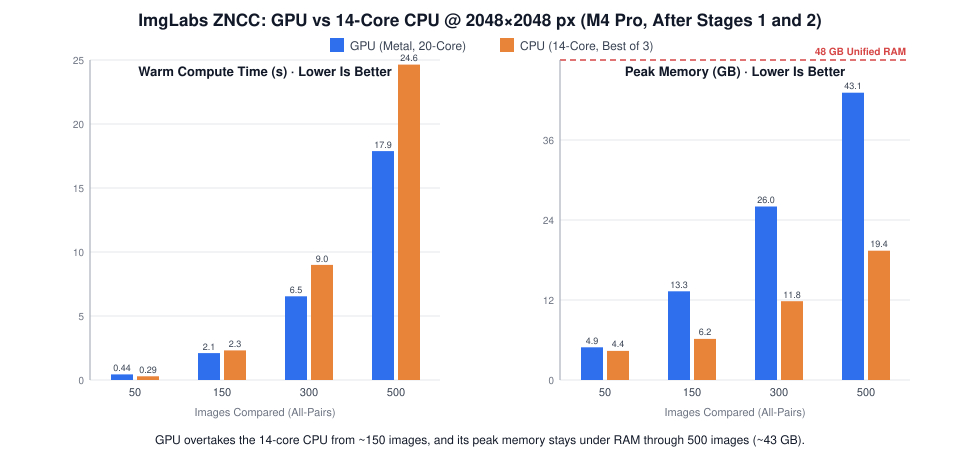
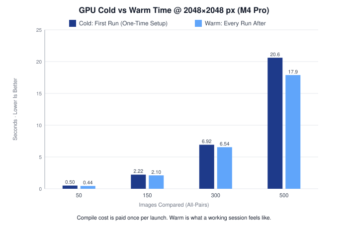
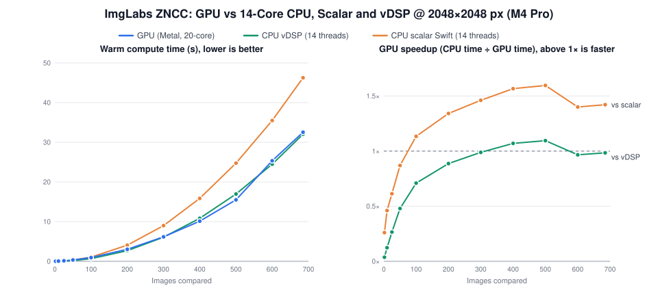
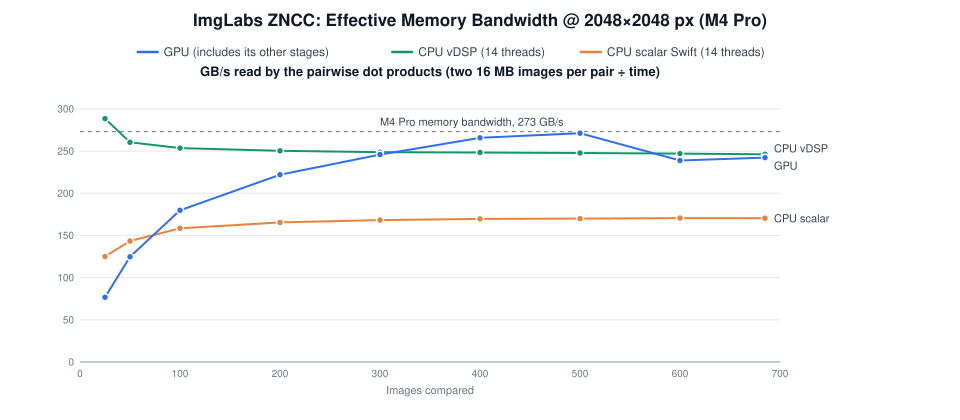
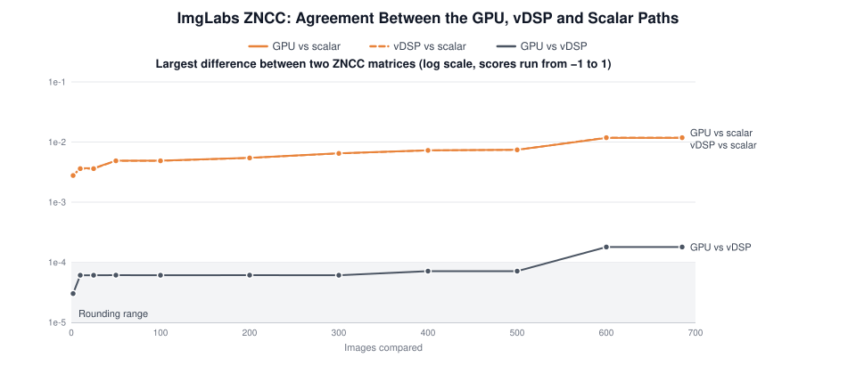
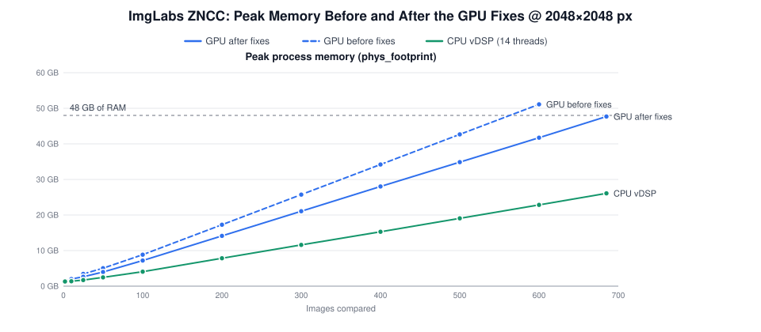

# ImgLabs ZNCC Performance Benchmarks

This page shows how fast the GPU version of the ZNCC similarity matrix runs compared to the CPU, how much memory each one uses, and what I learned along the way. All numbers come from the `PerformanceBenchmark` tool inside the app. Each time is the fastest of 3 runs, and memory is the whole app's `phys_footprint`.

## Test Machine

| | |
| --- | --- |
| Chip | Apple **M4 Pro**, 14-core CPU and 20-core GPU |
| Memory | **48 GB** unified memory |
| OS | macOS 26.2 for the first results, macOS 27 for the Accelerate comparison |
| Workload | An all-pairs ZNCC similarity matrix over `N` images (`N·(N+1)/2` pairs) at a fixed canvas size |
| Test images | Sony **ARW RAW** files from a high-resolution camera, so real camera output rather than made-up images |
| CPU versions | Plain Swift loops on 1 thread and on 14 threads (`DispatchQueue.concurrentPerform`). The Accelerate section adds vDSP versions of both. |

A few notes on reading the numbers:

- **Fastest of 3:** each time is the fastest of three runs. The fastest run is the one least affected by other things happening on the machine.
- **Cold and warm:** "cold" is the first run after the app launches, which includes compiling the Metal pipelines. "Warm" is every run after that.
- **Canvas size:** the RAW files are decoded and shrunk to the canvas size before comparing, so time and memory depend on the canvas size, not the original photo size.
- **One machine:** all of these numbers come from the one Mac above.

## How I Optimized the GPU Pipeline

I made four changes to the GPU pipeline, one at a time. The before and after pairs below use the same workload.

| Stage | What changed | What it removed |
| --- | --- | --- |
| **0. Starting point** | One `DotProduct` kernel per pair. Every stage copied its result back to the CPU as a `[Float]`, and the next stage copied it to the GPU again. | Nothing yet |
| **1. Batched dot product** | One `batchedDotArr` dispatch handles every pair (one threadgroup per pair, no atomics) instead of `N·(N+1)/2` separate kernels. | About 20,000 kernels, encoders, result buffers and observers |
| **2. Keep data on the GPU** | Each kernel hands its output to the next one as a `DeviceBuffer` instead of a `[Float]`. | Every GPU to CPU to GPU round trip, and the extra `[Float]` copy at each step |
| **3. Free memory early** | Buffers that are no longer needed (grayscale, then the squared arrays) are released between stages. | The dot product step no longer holds the grayscale and squared buffers |

**Before and after on the same workload (2048×2048 px):**

| Workload | Measure | Before | After stages 1 to 3 | Change |
| --- | --- | --- | --- | --- |
| 50 images | warm time | 1.38 s *(stage 0)* | 0.44 s | 3.1× faster |
| 50 images | peak memory | 9.43 GB *(stage 0)* | 4.91 GB | 1.9× less |
| 300 images | warm time | 26.09 s *(stage 1)* | 6.54 s | 4.0× faster |
| 300 images | peak memory | 54.15 GB *(stage 1)* | 26.03 GB | 2.1× less |

The 300-image case shows the biggest effect. At stage 1 it needed 54 GB, which is more than the 48 GB of RAM, so the Mac was swapping to disk and the run was slow. Stages 2 and 3 brought it down to 26 GB and the time dropped by 4×. Part of that speedup came from no longer swapping.

## First Results: GPU vs Plain Swift Loops

These first results compare the GPU with my plain Swift CPU loops (later I found that those loops were a weak baseline, so the [Accelerate section](#benchmarking-against-accelerate-vdsp) below gives a fairer comparison which we will get to that!). The CPU peak memory numbers in these tables were also affected by a measuring problem, which is explained in that section.

### 2048×2048 px

| Images | GPU cold | GPU warm | CPU 1-thread | CPU 14-thread | GPU peak | CPU peak | Warm speedup vs 14-core |
| ---: | ---: | ---: | ---: | ---: | ---: | ---: | ---: |
| 50 | 0.50 s | 0.44 s | 2.59 s | 0.29 s | 4.91 GB | 4.36 GB | 0.67× |
| 150 | 2.22 s | 2.10 s | 23.06 s | 2.31 s | 13.30 GB | 6.17 GB | 1.10× |
| 300 | 6.92 s | 6.54 s | 91.96 s | 8.99 s | 26.03 GB | 11.82 GB | 1.37× |
| 500 | 20.61 s | 17.88 s | 255.15 s | 24.64 s | 43.10 GB | 19.40 GB | 1.38× |

### 512×512 px

| Images | GPU cold | GPU warm | CPU 1-thread | CPU 14-thread | GPU peak | CPU peak | Warm speedup vs 14-core |
| ---: | ---: | ---: | ---: | ---: | ---: | ---: | ---: |
| 50 | 0.12 s | 0.07 s | 0.16 s | 0.02 s | 630 MB | 580 MB | 0.26× |
| 150 | 0.30 s | 0.24 s | 1.44 s | 0.14 s | 1.20 GB | 1.12 GB | 0.59× |
| 300 | 0.74 s | 0.63 s | 5.73 s | 0.55 s | 2.11 GB | 1.82 GB | 0.88× |
| 500 | 1.51 s | 1.42 s | 15.92 s | 1.54 s | 3.44 GB | 1.89 GB | 1.08× |

### Cold vs Warm

"Cold" is the first analysis after the app launches. It includes compiling the Metal pipelines and setting up buffers for the first time. The app builds one `MetalComputeContext` and keeps using it, so the pipelines only compile once per launch. "Warm" is every analysis after that.

The difference is small and is mostly a one-time setup cost. For example, 500 images at 2048 px took 20.6 s cold and 17.9 s warm. In normal use you only pay the cold cost once, so the warm time is what a working session actually feels like.

### What I Took From These Results

- **The GPU looked faster than the 14-core CPU for large sets.** At 2048 px it pulled ahead from about 150 images and was about 1.4× faster at 500. This turned out to be mostly because my CPU code was slow. The Accelerate section below explains why.
- **Each image needs enough work for the GPU to help.** At 512 px there is very little work per image, so the GPU's setup time dominates and the CPU stays ahead until about 500 images.
- **Memory fit in RAM up to 500 images.** The GPU used about 86 MB per image at 2048 px, so 500 images reached about 43 GB, just under the 48 GB limit. Before the optimizations, 200 images already used 37 GB.
- **Against a single CPU thread the gap was much bigger.** The GPU was 10 to 14× faster than one thread, but using all 14 threads closed most of that gap.

## Built for Volume

The similarity matrix compares every image with every other image, so the work grows with the square of the number of images (`O(N²)`). Doubling the images roughly quadruples the comparisons. That's why large sets are where performance matters most, and large sets are also what people actually use a duplicate finder for. Nobody needs one to sort through ten photos. Some of the uses I had in mind:

- **Event and wedding photography:** one shoot can have thousands of frames with long runs of nearly identical shots to narrow down before editing
- **Sports, wildlife and burst shooting:** burst mode creates dozens of near-duplicate frames for each moment, and you only want the sharpest one
- **Real estate, product and e-commerce photos:** lots of bracketed or nearly identical shots per listing that need narrowing down to one
- **Machine learning datasets:** removing near-duplicates before training or labeling, since duplicates that end up in both the training and test sets make accuracy look better than it is
- **Photo archives and stock libraries:** finding duplicate or re-uploaded images in large collections

## Benchmarking Against Accelerate (vDSP)

Ok so a keen viewer would realize that the numbers above raise some questions. The CPU code I compared against was plain Swift loops, and that (as we will see below) turned out to be a weak baseline. Swift won't change the order of floating-point additions, so the compiler can't use vector instructions for the dot product loop. It ends up doing one multiply and add at a time. I wanted to see how the GPU did against properly vectorized CPU code, so I added a third version to the benchmark that does the same math with Accelerate's vDSP library:

- **Grayscale:** `vDSP_vfltu8` pulls each RGBA channel out as a `Float` (stepping over 4 bytes at a time), then `vDSP.add(multiplication:_:)` applies the channel weights
- **Centering:** `vDSP.mean` finds the mean, then `vDSP.add` subtracts it
- **Pairs:** `vDSP.dot` for every pair, on 1 thread and on all 14 cores

Everything here was measured on the same M4 Pro, now on macOS 27, after the two GPU memory fixes described further down.

### Results at 2048×2048 px

| Images | GPU warm | CPU 14-thread vDSP | CPU 14-thread plain Swift | GPU vs vDSP | GPU vs plain Swift |
| ---: | ---: | ---: | ---: | ---: | ---: |
| 100 | 0.94 s | 0.67 s | 1.07 s | 0.71× | 1.13× |
| 200 | 3.04 s | 2.69 s | 4.08 s | 0.89× | 1.34× |
| 300 | 6.16 s | 6.09 s | 9.01 s | 0.99× | 1.46× |
| 400 | 10.13 s | 10.84 s | 15.87 s | 1.07× | 1.57× |
| 500 | 15.50 s | 16.97 s | 24.74 s | 1.09× | 1.60× |
| 600 | 25.34 s | 24.49 s | 35.48 s | 0.97× | 1.40× |
| 685 | 32.54 s | 32.03 s | 46.25 s | 0.98× | 1.42× |

- **With a fair CPU baseline, most of the GPU's lead goes away.** From 300 images up, the GPU and vDSP on 14 threads are within 10% of each other. In this run the GPU was up to 9% faster (1.09× at 500 images). But a later run, where the CPU went first, measured 0.95× at the same size. So for now I'm treating them as about even until I measure the timing more carefully.
- **My plain Swift loops were much slower than they needed to be.** On one thread, vDSP is about 7× faster (36.5 s vs 259 s at 500 images).

### Memory Bandwidth

I counted the bytes the dot products read (two 16 MB images per pair, for N(N+1)/2 pairs) and divided by the time. vDSP reads about 248 GB/s at every size from 200 images up. That's 91% of the M4 Pro's maximum of 273 GB/s. Going from 1 to 14 threads only made vDSP about 2.2× faster. So both the CPU and the GPU are limited by how fast data comes out of memory, not by the math. They share the same memory, which explains why they end up in the same place. The plain Swift loops level off around 170 GB/s, so I'm guessing they are limited by the math instead.

It also looks like the GPU gets some help from its caches. Its rate reaches 271 GB/s at 500 images, even though its time also includes the grayscale, mean and subtraction steps. That means the dot product step on its own is reading faster than main memory can deliver, so some of the data must be coming from cache on the chip. This is most likely because pairs next to each other share an image.

### Accuracy

Something I didn't expect: my original CPU version was the least accurate of the three. The GPU and vDSP results match within 1.8 × 10⁻⁴, but both differ from the plain Swift version by up to 1.2 × 10⁻². The plain Swift loop adds 4.2 million numbers one at a time, and small rounding errors build up. vDSP and the GPU add numbers in pairs, like a tree, so the errors stay much smaller.

### Reducing GPU Memory

The first results showed the GPU using about twice as much memory as the CPU. A GPU capture showed that each 2048×2048 buffer is about 16 MB (2048 × 2048 × 4 bytes, the same for 8-bit RGBA and 32-bit grayscale). At its peak, the pipeline was holding about four of these per image: the RGBA upload, the grayscale result, the mean-subtracted result and the combined copy that the batched dot product reads.

**1. An upload I never let go of.** The original RGBA pixels get copied into an `MTLBuffer` because the grayscale kernel needs them. After grayscale finished, two things still held on to that copy. One was the `BufferCache` in the grayscale factory, an object I made so buffers that many kernels use wouldn't be created over and over. The other was the grayscale kernels themselves, which stayed alive for the rest of the pipeline. Each image is only uploaded once per analysis, so the cache never actually saved anything, and we were losing 16 MB per image. I removed the cache from the grayscale factory and now release the kernels as soon as their results are collected. 

**2. A calculation I was doing twice.** The dot product matrix holds the dot product of every pair of mean-subtracted grayscale images. Its diagonal is each image dotted with itself, which is the sum of squares the ZNCC formula needs. I had been calculating that separately beforehand. Reading it from the diagonal removed a squaring kernel, its 16 MB buffer per image and an extra pass over the data. As a bonus, every image's ZNCC with itself now comes out as exactly 1, because the top and bottom of the fraction come from the same number.

| | Before | After |
| --- | ---: | ---: |
| GPU memory added per image | 64 MB | 48 MB |
| GPU peak, 500 images | 42.67 GB | 34.86 GB |
| GPU peak, 600 images | 51.10 GB (more than the 48 GB of RAM) | 41.73 GB |
| GPU peak, 685 images | not run | 47.69 GB |
| GPU warm, 500 images | 16.84 s | 15.50 s |
| GPU warm, 600 images | 31.36 s | 25.34 s |

The lower peak came from the first fix. The squared buffer from the second fix was already freed before the dot product step, which is where the peak happens. The second fix mostly helped the run time, with one less pass over the data and one less kernel launch per image. Most of the speedup at 600 images came from no longer running out of RAM. I made both changes at the same time, so I can't say exactly how much time each one saved.

### Measuring Memory Correctly

There were a few key issues with my memory tests of which the following were corrected:
1. **The memory sampler couldn't run during the CPU tests.** The project runs code on the main thread by default, so reading `phys_footprint` had to wait for the main thread. The CPU tests keep the main thread busy the whole time. So the CPU "peaks" were likely just readings from right before and right after each test, and that includes the CPU peak columns in the first results. Marking `currentFootprintBytes()` as `nonisolated` lets the sampler take a reading every 5 ms no matter what.
2. **Each test is now measured from its own starting point.** The report shows the peak minus the memory at the start of that test, instead of comparing every test to one starting number.
3. **I added a short wait before each test.** It keeps checking until memory stops dropping, for up to 5 seconds, so the system can free what the previous test left behind. This didn't work that well. After the GPU test, tens of gigabytes can take longer than that to free, and two of the plain Swift readings started too high to be valid. One started at 19.19 GB instead of about 11.3 GB.
4. **The CPU tests now run before the GPU test.** After that change, the plain Swift memory matches one 16 MB array per image: 3.06 GB at 200 images (3.13 GB expected) and 7.74 GB at 500 images (7.81 GB expected).

Two things still aren't quite right. Every test after the plain Swift one starts about 1 GB higher, probably memory the system keeps around to reuse. Because of this, the vDSP memory numbers read about 1 GB too low, even though its peak matches the plain Swift peak. The order also affects timing. With the GPU going last, its 500-image time was 17.83 s instead of 15.50 s. A better setup would measure memory in one pass with the CPU first, and measure time by switching back and forth between the versions.

## Reproducing

These numbers come from [`PerformanceBenchmark`](../ImgLabs/ImageCompute/PerformanceBenchmark.swift), a testing tool kept in the project. It's turned off by default. To run it:

1. Set `PerformanceBenchmark.isEnabled = true`.
2. **Build in Release.** A Debug build leaves the CPU code unoptimized and makes the GPU look better than it is.
3. Import at least two images, then press **Run GPU vs CPU Benchmark** in the sidebar. If you have fewer than two images, it uses made-up images at the current Max Canvas Size instead.

The report prints to the Xcode console. The button runs the same `ImageCorrelation.similarityMatrix` the app uses, plus plain Swift and vDSP CPU versions (each on 1 thread and on all cores, with the CPU versions running first). It also tracks peak `phys_footprint` throughout.
