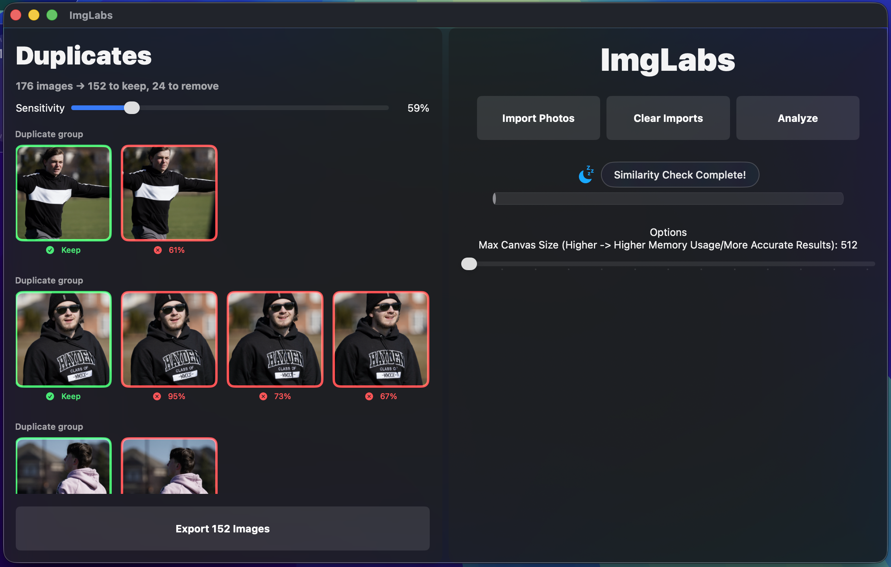
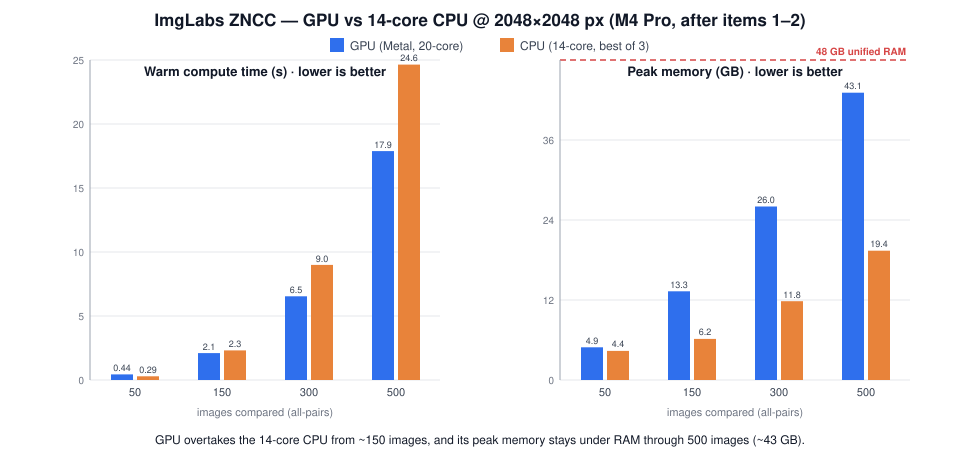
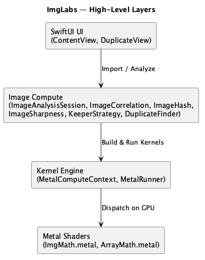
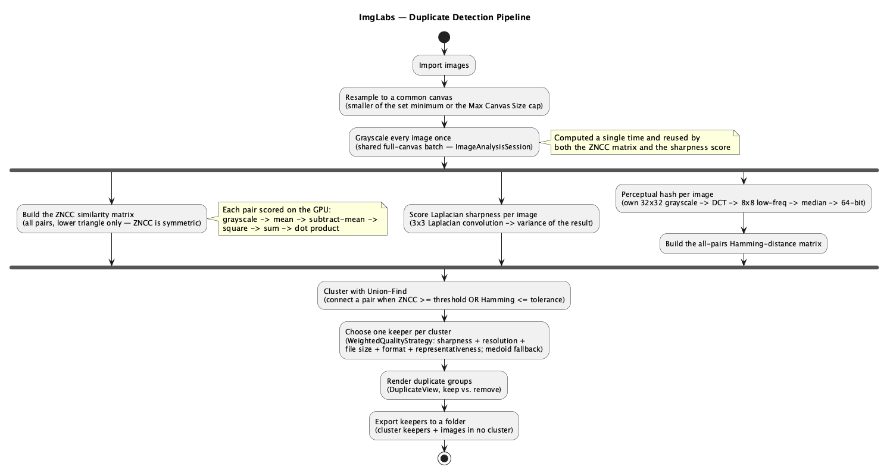
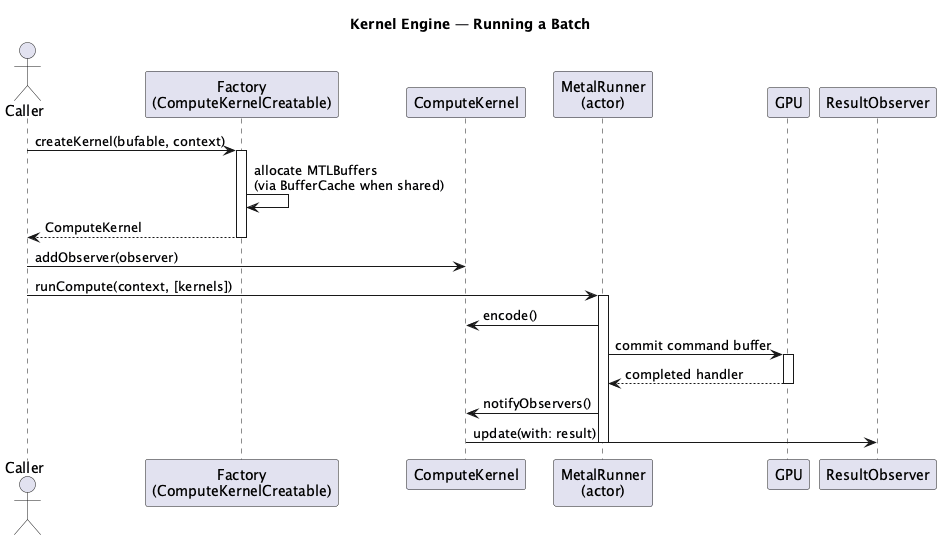
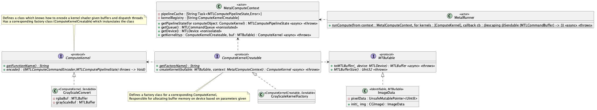

# ImgLabs

**GPU-accelerated perceptual duplicate-photo detection — a native macOS app powered by a Metal compute engine**

ImgLabs finds duplicate and near-duplicate images. It scores every pair of imported images two ways: pixel-level **Zero-Normalized Cross-Correlation (ZNCC)** and a **perceptual hash (pHash)**, it then clusters the matches so near-identical shots can be reviewed and thinned down to a single keeper. For each cluster it recommends which image to keep by blending quality signals, one of which is a GPU-computed **Laplacian sharpness** score. The entire numerical pipeline runs as compute shaders on the GPU: comparing large pixel count images is a lot of floating-point operations, ImgLabs pushes that work off the CPU onto Metal, where it runs in parallel across thousands of threads.

Powering the app is the **Kernel Engine**: a reusable, thread-safe framework for authoring, batching, and dispatching Metal compute kernels with strongly-typed, `async`/`await`-friendly results. The engine is deliberately decoupled from ImgLabs itself and can be dropped into any Metal project that needs a clean abstraction over raw GPU code.

> **Status:** Usable end to end — import images, press **Analyze**, review the duplicate clusters with an adjustable sensitivity threshold, and export the keepers. Active development continues on additional operations and UI polish.



*Duplicate groups on the left (green = keep, red = flagged with its similarity to the keeper); import/analyze controls, status, and the memory-vs-accuracy Max Canvas Size option on the right.*

---

## Built for Volume

ImgLabs is designed for **large image sets**, for ex: a photographer's full shoot, an ML training set, a stock archive. The similarity matrix is **all-pairs**, so the work grows as `O(N²)`: doubling the images roughly quadruples the comparisons. That is where offloading to the GPU boosts performance.

A series of GPU-pipeline optimizations: batching the ~`N²` dot products into a single dispatch, keeping intermediate results resident on the GPU instead of round-tripping them to the CPU, and releasing them the moment they're spent:



On an **M4 Pro** (14-core CPU, 20-core GPU, 48 GB), comparing **500 images at 2048×2048 px** the GPU finishes a warm run in ~18 s — **~1.4× faster than a fully parallel 14-core CPU** while keeping peak memory (~43 GB) under RAM. The GPU overtakes the CPU from roughly 150 images. Below that, dispatch overhead dominates and the CPU wins. In short: the more you throw at it, the more the GPU wins.

**Where this matters:** event & wedding culling, sports and wildlife burst shooting, real-estate/product sets, ML dataset de-duplication, and stock or digital-asset archives.

See **[Docs/Benchmarks.md](Docs/Benchmarks.md)** for the full methodology, the cold-vs-warm breakdown, the optimization journey, and results across 50–500 images at both canvas sizes.

---

## Roadmap

Heading toward a v1 App Store release (free)

### v1 — Ship blockers

| # | Task                              | Status | Blocked by | Notes                                                                                                                            |
| --- | --- | --- | --- |----------------------------------------------------------------------------------------------------------------------------------|
| 1 | Perceptual hash engine (Metal)    | Done | — | `convertDCT` shader + `DCT32` `ComputeKernel`; 32×32 → DCT → 8×8 low-frequency → median → 64-bit pHash                           |
| 2 | Duplicate grouping via image hash | Done | 1 | All-pairs Hamming-distance matrix unions near-duplicates (OR'd with ZNCC); live "Hash tolerance" slider                          |
| 3 | Laplacian sharpness kernel        | Done | — | `convoluteImage` (3×3 Laplacian) + `calculateVariance` shaders → variance-of-Laplacian focus score per image                     |
| 4 | Keeper recommendation logic       | Done | 2, 3 | `WeightedQualityStrategy`: normalized blend of sharpness + resolution + file size + format + representativeness, medoid fallback |
| 5 | Photos library support (PhotoKit) | In Progress | 8 | Permission flow + fetch + delete (goes to Recently Deleted)                                                                      |
| 6 | Drag-and-drop folder scan         | To do | 8 | Drop on window / Dock icon, security-scoped bookmarks                                                                            |
| 7 | Review UI                         | To do | 1–6 | One window: groups grid, keeper pre-selected, batch remove                                                                       |
| 8 | App sandbox + entitlements        | In progress | — | Photos + user-selected file access                                                                                               |
| 9 | App Store assets                  | To do | 7 | Name check, icon, screenshots, description                                                                                       |
| 10 | Update documentation              | To do | 2–7 | Reconcile README + diagrams with the shipped v1 (perceptual hash + Hamming, keeper logic, Photos/folder input)                   |

---

## Highlights

- **Duplicate detection** — imported images are scored pairwise (ZNCC *and* perceptual hash), clustered with union-find, and grouped into keep/remove sets
- **Perceptual hashing (pHash)** — a DCT-based 64-bit fingerprint per image catches near-duplicates that pixel correlation can miss (crops, recompression, colour shifts, rescales), paired within a Hamming-distance tolerance are grouped as duplicates
- **Quality-aware keeper** — per cluster, ImgLabs recommends the best image from a normalized blend of Laplacian sharpness, resolution, file size, source format, and how representative it is of the cluster
- **Laplacian sharpness** — a GPU variance-of-Laplacian focus score ranks how sharp each image is, so the in-focus frame in a burst is preferred
- **Interactive sensitivity** — separate ZNCC-threshold and hash-tolerance sliders re-cluster the results live, trading precision for recall without recomputing any GPU work
- **One-click export** — copies each cluster's keeper plus every image that belongs to no cluster into a chosen folder, leaving the flagged duplicates behind (with automatic filename de-duplication)
- **Bounded memory** — a Max Canvas Size control caps the comparison resolution (512–2048 px per side), so per-image memory stays fixed regardless of how large the originals (e.g. RAW) are
- **GPU-accelerated ZNCC** — every stage (grayscale, mean, mean-subtraction, squaring, summation, dot product) runs as a Metal kernel. No per-pixel work happens on the CPU
- **Upload-once buffer cache** — source pixel data reused across the all-pairs matrix is uploaded to the GPU a single time via a reference-identity `BufferCache` actor, instead of once per comparison
- **Structured concurrency** — Metal objects aren't uniformly thread-safe, so the engine leans on Swift `actor`s to serialize access, caches compiled pipeline states, and confines command encoding to a single thread across `await` boundaries
- **A reusable framework** — the Kernel Engine exposes a focused set of protocols (`ComputeKernel`, `ComputeKernelCreatable`, `MTBufable`, `ResultObserver`) that make adding a new GPU operation possible without touching the scheduler

## Requirements

- **macOS 26.2 (Tahoe) or later**, on a Metal-capable Mac
- **Xcode 26 or later** to build (Swift language mode 5 or later)

## Building & Running

```sh
open ImgLabs.xcodeproj
```

Build and run the `ImgLabs` scheme (⌘R), import images from the native macOS file picker, then press **Analyze**. Adjust the **Sensitivity** (ZNCC) and **Hash tolerance** (perceptual-hash) sliders to control how aggressively near-duplicates are grouped.

---

## How it Works

ImgLabs is organized into layers, each depending only on the one beneath it: the UI drives image compute, which composes GPU work through the Kernel Engine, which dispatches the raw Metal shader functions.



*Source: [`layers.puml`](ImgLabs/Diagrams/Architecture/layers.puml).*

### From Import to Duplicates

A run flows from imported files to reviewable duplicate groups. Because imported images can differ in size, they're first resampled onto a common canvas (the smaller of the set's minimum dimensions or a user-set **Max Canvas Size** cap (512–2048 px per side)) so the pixel-wise correlation compares equal-length arrays while keeping per-image memory bounded regardless of the originals' resolution. The GPU then builds an all-pairs similarity matrix (computing only the lower triangle, since ZNCC is symmetric) which is clustered on the CPU into duplicate groups.



*Source: [`duplicatePipeline.puml`](ImgLabs/Diagrams/Pipeline/duplicatePipeline.puml).*

Clustering uses a **union-find** (disjoint-set) structure: an image pair is connected when it clears the ZNCC threshold **or** its perceptual hashes are within the Hamming-distance tolerance (the two signals are OR'd, so hashing only ever adds near-duplicate edges), and connected images collapse into a single group (`DuplicateFinder.swift`). For each group, ImgLabs recommends a keeper via a pluggable `KeeperStrategy`: the default `WeightedQualityStrategy` scores each member on a normalized blend of Laplacian sharpness, resolution, file size, format, and representativeness, falling back to the **medoid** (the image most similar on average to its cluster) when no quality signals are available. Both sliders are live controls, so re-clustering is instant and never re-runs the GPU work.

Reviewed results can be exported: **Export** copies every kept image, each cluster's keeper plus all images that belong to no cluster into a chosen folder, skipping the flagged duplicates. Copies happen off the main thread, filename collisions are resolved automatically (`photo-1.jpg`), and one unreadable source is recorded and skipped rather than aborting the run.

### The Algorithm: ZNCC

Zero-Normalized Cross-Correlation is a lighting-invariant measure of similarity between two signals. For two images `A` and `B` it yields a value in `[-1, 1]`, where `1` means identical:

$$
\text{ZNCC}(A, B) = \frac{\sum_i (A_i - \bar{A})(B_i - \bar{B})}{\sqrt{\sum_i (A_i - \bar{A})^2 \; \sum_i (B_i - \bar{B})^2}}
$$

where $\bar{A}$ and $\bar{B}$ are the mean pixel values of images $A$ and $B$, and $i$ ranges over every pixel.

Subtracting the mean removes overall brightness; normalizing by the standard deviations removes contrast — so ZNCC compares *structure*, not exposure. `ImageCorrelation` realizes this as a chain of GPU passes: **grayscale → mean → subtract-mean → square → sum → dot product**, each one a `ComputeKernel` run through the engine.

### Perceptual Hashing (pHash)

ZNCC is precise but literal as it compares actual pixels, so a crop, a re-compression or a resize can pull two obviously-identical shots below the threshold. The perceptual hash complements it with a compact, content-based fingerprint that survives those transformations.

Each image is reduced to a 64-bit hash (`ImageHash`, `DCT32`):

1. **Downscale** to a 32×32 grayscale thumbnail — throwing away resolution keeps only gross structure.
2. **2-D Discrete Cosine Transform** of that 32×32 block on the GPU (`convertDCT` in `ImgMath.metal`). The DCT is computed *separably* as two matrix multiplies against a precomputed 8×32 basis $C[u][x] = \alpha(u)\cos\!\big((2x{+}1)u\pi/2N\big)$: one threadgroup handles one image, its 32×8 threads run pass 1 (`T = C · f`) into threadgroup memory, sync on a barrier, then run pass 2 (`F = T · Cᵀ`) — keeping only the top-left **8×8 block of lowest-frequency coefficients**, where an image's perceptual "shape" concentrates.
3. **Median threshold** the 64 coefficients: each becomes a single bit (1 if ≥ the block median, else 0), yielding a 64-bit hash that's invariant to overall brightness.

Two images are compared by **Hamming distance** (i.e., the number of differing bits). `getHammingDistanceMtx` builds the all-pairs distance matrix (in parallel across a `TaskGroup`), and grouping treats any pair within the tolerance as a near-duplicate. Because pHash works on tiny 32×32 copies, it runs as its own small pipeline, separate from the full-canvas grayscale batch the ZNCC/sharpness stages share.

### Laplacian Sharpness

When several frames in a burst are duplicates, the one worth keeping is usually the **sharpest**. ImgLabs measures focus with **variance of the Laplacian** (`ImageSharpness`):

1. **Convolve** the grayscale image with a 3×3 Laplacian kernel (`convoluteImage` in `ImgMath.metal`), a second-derivative edge detector with one thread per pixel, out-of-bounds neighbours clamped to zero. A crisp, in-focus image has strong edge responses and a blurry one is smooth and responds weakly
2. **Variance** of that edge-response image (`calculateVariance`): each threadgroup reduces a slice of one image in shared memory (a tree reduction over `float2` partials), then atomically folds its running Σx and Σx² into that image's accumulator. The CPU finishes with `variance = Σx²/N − (Σx/N)²`

A higher variance means sharper. The score feeds `WeightedQualityStrategy` as the dominant keeper signal, alongside resolution, file size, and format rank.

### Sharing Work Across Analyses

Both the ZNCC matrix and the Laplacian sharpness score start from the **full-canvas grayscale of every image**. `ImageAnalysisSession` computes that batch exactly once and hands the same resident GPU buffers to both consumers, so pressing **Analyze** grayscales each image a single time rather than once per analysis. Each analysis (similarity matrix, sharpness, hashes) is memoized as an in-flight `Task`, so concurrent callers await the same computation instead of duplicating it.

### The Kernel Engine

The engine separates *what* a kernel computes from *how* it is scheduled on the GPU. Its core types live in `KernelEngine/HLObjects/`:

| Type | Kind | Responsibility                                                                                                                                                                      |
| --- | --- |-------------------------------------------------------------------------------------------------------------------------------------------------------------------------------------|
| `MetalComputeContext` | `actor` | Owns the `MTLDevice`, command queue, and shader library. Caches compiled pipeline states (keyed by function name, compiled lazily via `Task`) and holds the kernel-factory registry |
| `ComputeKernel` | `protocol` | Describes one kernel: its Metal function name and an `encode()` closure that binds buffers and configures thread dispatch. Is itself observable                                     |
| `ComputeKernelCreatable` | `protocol` | A factory that allocates the required `MTLBuffer`s and instantiates a `ComputeKernel`                                                                                               |
| `MetalRunner` | `actor` | Batches kernels onto one command buffer, dispatches to the GPU, `await`s completion, then notifies observers                                                                        |
| `BufferCache` | `actor` | Caches the `MTLBuffer` produced for each source, keyed by reference identity, so data reused across many kernels is uploaded to the device only once                                |
| `MTBufable` | `protocol` | Anything that can turn itself into an `MTLBuffer`. An `ImageData`, or an intermediate result array feeding the next stage                                                           |
| `ObservableResult` / `ResultObserver` / `ObserverStore` | `protocol` / `actor` | A typed, `async` observer pattern for pulling results back off the GPU once a run completes                                                                                         |

**Concurrency model.** Because Metal's mutable objects can't be freely shared across threads, the engine:

- serializes device/pipeline/registry access behind `MetalComputeContext` (an `actor`);
- pre-fetches every pipeline state and `encode()` closure *before* touching the command buffer, then performs the actual encoding on a single thread so no Metal object is mutated concurrently across a suspension point
- caches pipeline compilation per function name, so the second use of a kernel skips the expensive `makeComputePipelineState` step
- delivers results through `withCheckedContinuation`, bridging Metal's completion-handler callback into `async`/`await`

**Kernels.** High-level Swift wrappers in `HLShaders/` (`GrayScaleConvert`, `MeanValue`, `DotProduct`, `BatchedDotProduct`, `Subtraction`, `DCT32`, `ConvoluteImage`, `Variance`) pair with the raw Metal functions in `ComputeShaders/` (`ImgMath.metal`, `ArrayMath.metal`).

### Running a Batch of Kernels

A factory allocates the device buffers and builds each kernel: `MetalRunner` encodes the whole batch onto one command buffer, dispatches it, and fans the finished results back out to any subscribed observers.



*Source: [`kernelRun.puml`](ImgLabs/Diagrams/Kernel/kernelRun.puml).*

### Kernel Engine Class Diagram

The protocols and actors that make up the engine, and how they relate:



*Source: [`kernelSubsystem.puml`](ImgLabs/Diagrams/Kernel/kernelSubsystem.puml).*

---

## Project Layout

```
ImgLabs/
├── ImgLabsApp.swift             App entry point
├── ContentView.swift            SwiftUI UI, app-state models, import/analyze flow
├── DuplicateView.swift          Duplicate-cluster UI, sensitivity/hash-tolerance sliders, and keeper export
├── ImageData.swift              Wraps a CGImage; resamples to a canvas; exposes RGBA as an MTLBuffer
├── ImageError.swift             Image-related error types
├── ImageCompute/
│   ├── ImageAnalysisSession.swift  Coordinates one run; computes the shared grayscale batch once
│   ├── ImageCorrelation.swift   ZNCC similarity + all-pairs (strided) similarity matrix
│   ├── ImageHash.swift          Perceptual (DCT) hash + all-pairs Hamming-distance matrix
│   ├── ImageSharpness.swift     Variance-of-Laplacian focus score per image
│   ├── KeeperStrategy.swift     Quality signals + keeper-selection strategies (weighted / medoid)
│   └── DuplicateFinder.swift    Union-find clustering (ZNCC + Hamming) + keeper dispatch
├── KernelEngine/
│   ├── HLObjects/               Core engine: context, runner, buffer cache, protocols, observers
│   ├── HLShaders/               Swift kernel wrappers (grayscale, mean, dot, subtraction, DCT, convolution, variance)
│   └── ComputeShaders/          Raw Metal (.metal) kernel functions
└── Diagrams/                    Architecture & pipeline diagrams (PlantUML)
```

## Adding a New GPU Operation

The engine is built to be extended without modifying the scheduler:

1. Write the kernel function in a `.metal` file under `ComputeShaders/`
2. Add a `ComputeKernel` type in `HLShaders/` that returns the Metal function name and implements `encode()` (buffer binding + thread dispatch)
3. Add a matching `ComputeKernelCreatable` factory that allocates the required buffers
4. Attach a `ResultObserver` and run it through `MetalRunner.runCompute(...)`

The new operation composes with every existing kernel — its output (`MTBufable`) can feed straight into the next stage.
