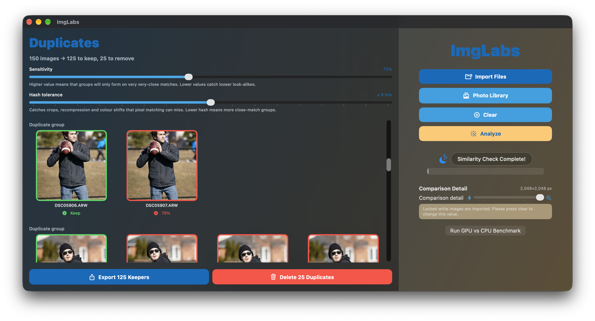
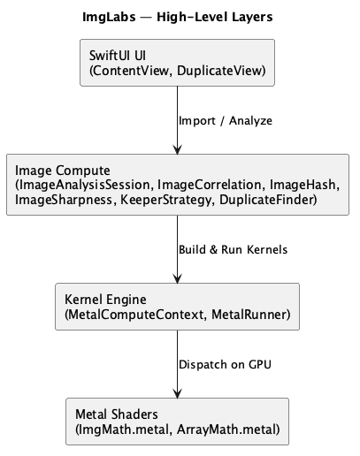
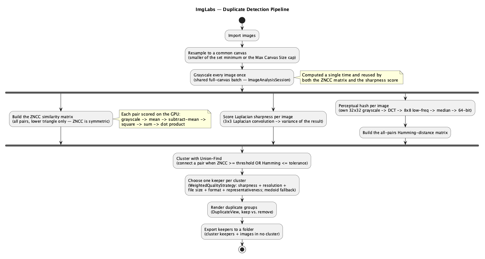
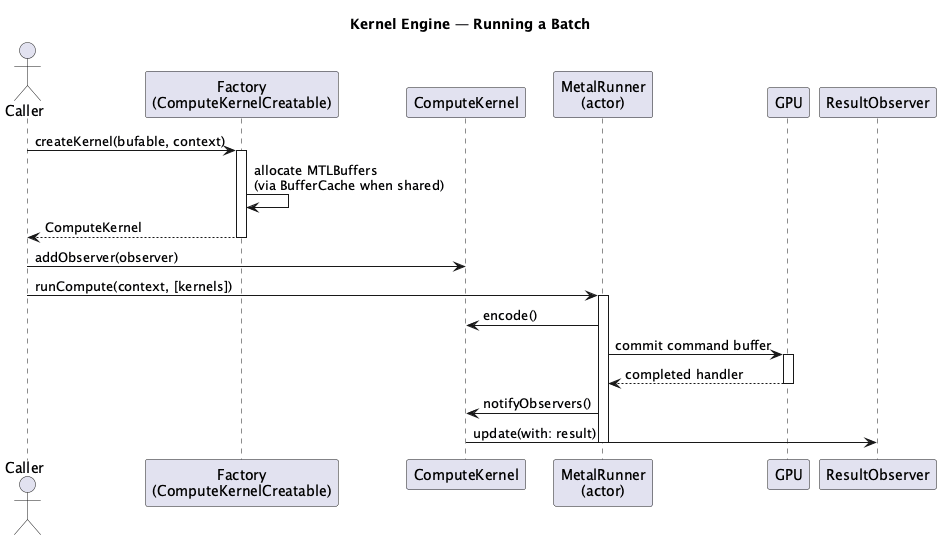
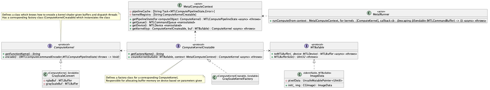
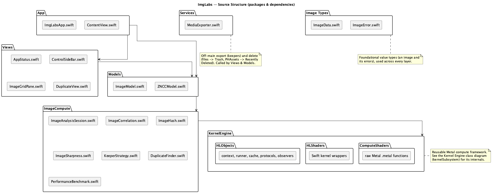

# ImgLabs

**A native macOS app that finds duplicate photos, with the heavy math running on the GPU through Metal**

ImgLabs finds duplicate and near-duplicate photos. It compares every pair of imported images in two ways: a pixel-by-pixel score called **Zero-Normalized Cross-Correlation (ZNCC)**, and a **perceptual hash (pHash)**. It then groups the matches so you can review near-identical shots and narrow each group down to one keeper. For each group it suggests which photo to keep based on a few quality signals, including a **Laplacian sharpness** score computed on the GPU. Comparing large images takes a lot of floating-point math, so ImgLabs moves that work off the CPU and onto Metal, where it runs across thousands of threads at once.

Under the app is the **Kernel Engine**, a reusable framework built for writing, batching and running Metal compute kernels. It's thread-safe, works with `async`/`await` and returns typed results. It's kept separate from the rest of ImgLabs, so it could be dropped into any Metal project that wants a cleaner way to work with GPU code.

> **Status:** Usable from start to finish. You can import images, press **Analyze**, review the duplicate groups with an adjustable sensitivity slider and export the keepers. I'm still working on more operations and polishing the UI.



*Duplicate groups are on the left (green is the keeper, red is flagged, along with its similarity to the keeper). Above them are the Sensitivity and Hash tolerance sliders, and below them are buttons to export the keepers or delete the duplicates. On the right are the import, clear and analyze controls, the status, and the Comparison Detail setting, which trades memory for accuracy.*

## Performance

ImgLabs is meant for **large sets of images**, like a photographer's full shoot, a machine learning training set or a stock archive. Every image gets compared with every other image, so the work grows with the square of the number of images (`O(N²)`). Doubling the images roughly quadruples the comparisons.

To get there, a series of changes to the GPU pipeline: batching all of the dot products into one dispatch, keeping results on the GPU between steps instead of sending them back to the CPU, and freeing memory as soon as it's no longer needed. Here's how it compares with the CPU at **500 images on a 2048×2048 canvas**, on an M4 Pro with a 14-core CPU, a 20-core GPU and 48 GB of memory:

| Version | Time | Compared to the GPU |
| --- | ---: | ---: |
| GPU (Metal, 20 cores) | 15.5 s | |
| CPU, plain Swift, 1 thread | 259.0 s | 16.7× slower |
| CPU, plain Swift, 14 threads | 24.7 s | 1.6× slower |
| CPU, Accelerate vDSP, 1 thread | 36.5 s | 2.4× slower |
| CPU, Accelerate vDSP, 14 threads | 17.0 s | about the same (see below) |

### Single vs Multi-Threaded

Going from 1 thread to all 14 makes a huge difference for the plain Swift version. It runs about 10.5× faster (259.0 s down to 24.7 s), which takes it from 16.7× slower than the GPU to only 1.6× slower. For the vDSP version, 14 threads make it about 2.2× faster (36.5 s down to 17.0 s). The vDSP version is already reading data about as fast as the memory can supply it, so adding more threads doesn't help much. The plain Swift version is held back by the math instead, so more threads keep helping.

### Pushing It Against Accelerate

The first CPU comparison used plain Swift loops, and the GPU came out about 1.4× faster than all 14 cores. Would this hold up against properly optimized CPU code? The following made use of Apple's Accelerate framework (vDSP in particular). It turns out most of the GPU's lead came from the naive CPU code being slow. Swift won't change the order of floating-point additions, so loops couldn't use the CPU's vector instructions and did one multiply and add at a time.


With vDSP on all 14 cores, the CPU and the GPU end up within about 10% of each other from 300 images up. Both are limited by how fast data comes out of memory rather than by the math, and since they share the same memory, they land in the same place. Working through this also turned up a few things:

- **The GPU was using more memory than it needed to.** Two fixes cut its memory from 64 MB to 48 MB per image: releasing each image's upload once grayscale was done with it, and reading each image's sum of squares from the diagonal of the dot product matrix instead of calculating it separately. 600 images now fit in RAM.
- **The naive CPU version was the least accurate.** Adding millions of numbers one at a time lets rounding errors build up. The GPU and vDSP versions agree with each other much more closely.
- **Some memory measurements were inaccurate.** The memory sampler couldn't run while the CPU tests were busy, and the order of the tests affected the results.

The full write-up, including how everything was measured, cold and warm times, memory bandwidth and accuracy, is in **[Docs/Benchmarks.md](Docs/Benchmarks.md)**.

## Roadmap

### v1: Ship Blockers

| # | Task | Status | Blocked by | Notes |
| --- | --- | --- | --- | --- |
| 1 | Perceptual hash engine (Metal) | Done | None | `convertDCT` shader and `DCT32` `ComputeKernel`. 32×32 image, then DCT, then the 8×8 lowest frequencies, then the median, giving a 64-bit pHash |
| 2 | Duplicate grouping via image hash | Done | 1 | All-pairs Hamming distance matrix joins near-duplicates (combined with ZNCC using OR). Live "Hash tolerance" slider |
| 3 | Laplacian sharpness kernel | Done | None | `convoluteImage` (3×3 Laplacian) and `calculateVariance` shaders give a variance-of-Laplacian focus score per image |
| 4 | Keeper recommendation logic | Done | 2, 3 | `WeightedQualityStrategy`: a normalized mix of sharpness, resolution, file size, format and how representative the photo is, falling back to the medoid |
| 5 | Photos library support (PhotoKit) | In progress | 8 | Permission flow, fetching and deleting (to Recently Deleted) are done and need testing |
| 6 | Drag-and-drop folder scan | In progress | 8 | Dropping onto the window, with effects, is done and needs testing |
| 7 | Review UI | In progress | 1 to 6 | Added help hints and more context to buttons and sliders, and redid the color palette |
| 8 | App sandbox and entitlements | In progress | None | Needs access to the full library and permissions are still being updated. The app-scope bookmarks entitlement is pending (for the v1.0 Extended reference libraries) |
| 9 | App Store assets | To do | 7 | Name check, icon, screenshots and description |
| 10 | Update documentation | To do | 2 to 7 | Bring the README and diagrams in line with the shipped v1 (perceptual hash and Hamming distance, keeper logic, Photos and folder input) |

### v1.0 Extended: Reference Libraries

The idea is to point ImgLabs at a library you keep long term (for example a home lab or NAS folder). Then on each import, it flags the photos that already exist there, so duplicates never get added in the first place. Matching is a pHash Hamming distance lookup against a saved index. The library only pays the GPU hashing cost once, and after that it rescans only what changed.

| # | Task | Status | Blocked by | Notes |
| --- | --- | --- | --- | --- |
| 1 | Reference schema and saving | Done | None | `ReferenceLibrary`, `LibraryRoot` and `ReferenceEntry`, one JSON file per library. `ReferenceManager` creates, loads and commits them (atomic write still to do) |
| 2 | Library indexer (`build`) | Done | 1 | `ReferenceIndexer.build` skips nested roots, decodes in parallel (with a limit) and hashes on the GPU in chunks, producing entries and a security-scoped bookmark for each root |
| 3 | Incremental rescan | Done | 2 | `ReferenceIndexer.rescan` and `ReferenceManager.rescanReferenceLibrary` re-hash only new or changed files (by size and modified time), drop deleted ones and refresh old bookmarks |
| 4 | App-scope bookmarks entitlement | In progress | 8 | `com.apple.security.files.bookmarks.app-scope`, so picked folders still resolve after a relaunch. Without it, `build` and `rescan` can't reach the roots |
| 5 | Candidate match query | Done | 1 | `ReferenceManager.checkForReference` looks up each candidate against the index in parallel and returns the first entry within tolerance (reusing the hashes from the current run) |
| 6 | Reference library UI | To do | 5 | Create and name a library, add folders, rebuild or rescan, an "in library" badge on each image, and an export option to skip photos already in the library |

## Highlights

- **Duplicate detection:** every pair of images is scored with both ZNCC and a perceptual hash, then grouped with union-find into keep and remove sets
- **Perceptual hashing (pHash):** a 64-bit fingerprint per image, built from a DCT, catches near-duplicates that the pixel comparison can miss, like crops, recompressed files, color shifts and resized copies. Pairs within a Hamming distance tolerance are grouped as duplicates
- **Picking the keeper:** for each group, ImgLabs suggests the best photo using a mix of sharpness, resolution, file size, file format and how typical it is of the group
- **Laplacian sharpness:** a GPU focus score ranks how sharp each photo is, so the in-focus frame in a burst gets picked
- **Live sliders:** separate sliders for the ZNCC threshold and the hash tolerance regroup the results instantly, without re-running any GPU work
- **One-click export:** copies each group's keeper, plus every photo that isn't in a group, into a folder you choose, and leaves the flagged duplicates behind (renaming files automatically if names clash)
- **Bounded memory:** a Max Canvas Size setting caps the comparison size at 512 to 2048 px per side, so memory per image stays the same no matter how big the originals are (like RAW files)
- **ZNCC on the GPU:** every step (grayscale, mean, subtracting the mean and the dot products) runs as a Metal kernel, with no per-pixel work on the CPU. Each image's sum of squares comes straight from the diagonal of the dot product matrix
- **Keeps data on the GPU:** each step hands its result to the next one without copying it back to the CPU, and buffers are freed as soon as they're no longer needed
- **Structured concurrency:** Metal objects aren't all thread-safe, so the engine uses Swift `actor`s to control access, caches compiled pipelines and does all command encoding on one thread across `await`s
- **A reusable framework:** the Kernel Engine has a small set of protocols (`ComputeKernel`, `ComputeKernelCreatable`, `MTBufable`, `ResultObserver`), so adding a new GPU operation doesn't require touching the scheduler

## Requirements

- **macOS 26.2 (Tahoe) or later**, on a Mac that supports Metal
- **Xcode 26 or later** to build (Swift language mode 5 or later)

## Building and Running

```sh
open ImgLabs.xcodeproj
```

Build and run the `ImgLabs` scheme (⌘R), import images with the macOS file picker, then press **Analyze**. Use the **Sensitivity** (ZNCC) and **Hash tolerance** (perceptual hash) sliders to control how strictly near-duplicates get grouped.

## How It Works

ImgLabs is built in layers, and each layer only depends on the one below it. The UI drives the image analysis, which builds its GPU work through the Kernel Engine, which runs the actual Metal shader functions.



*Source: [`layers.puml`](ImgLabs/Diagrams/Architecture/layers.puml).*

### From Import to Duplicates

A run goes from imported files to duplicate groups you can review. Imported images can be different sizes, so they're first resized onto a shared canvas. The canvas is the smaller of the set's smallest dimensions or the **Max Canvas Size** cap (512 to 2048 px per side). This way the pixel comparison always works on arrays of the same length, and memory per image stays bounded no matter how big the originals are. The GPU then builds the all-pairs similarity matrix. It only computes the lower half, since ZNCC gives the same score in both directions. The CPU then groups the results into duplicate sets.



*Source: [`duplicatePipeline.puml`](ImgLabs/Diagrams/Pipeline/duplicatePipeline.puml).*

Grouping uses a **union-find** (disjoint-set) structure. Two images are linked when their ZNCC score clears the threshold **or** their perceptual hashes are within the Hamming distance tolerance. The two checks are combined with OR, so hashing can only add near-duplicate links, never remove them. Linked images end up in the same group (`DuplicateFinder.swift`). For each group, a pluggable `KeeperStrategy` suggests a keeper. The default, `WeightedQualityStrategy`, scores each photo on a normalized mix of Laplacian sharpness, resolution, file size, format and how representative it is. If no quality signals are available, it falls back to the **medoid**, the photo that's most similar on average to the rest of its group. Both sliders are live, so regrouping is instant and never re-runs the GPU work.

When you're done reviewing, **Export** copies every kept photo (each group's keeper, plus every photo that isn't in a group) into a folder you choose and skips the flagged duplicates. Copying happens off the main thread, name clashes get renamed automatically (`photo-1.jpg`), and if one file can't be read, it's noted and skipped instead of stopping the whole export.

### The Algorithm: ZNCC

Zero-Normalized Cross-Correlation measures how similar two signals are, and it isn't affected by lighting. For two images `A` and `B` it gives a value from -1 to 1, where 1 means identical:

$$
\text{ZNCC}(A, B) = \frac{\sum_i (A_i - \bar{A})(B_i - \bar{B})}{\sqrt{\sum_i (A_i - \bar{A})^2 \, \sum_i (B_i - \bar{B})^2}}
$$

Here $\bar{A}$ and $\bar{B}$ are the average pixel values of images $A$ and $B$, and $i$ goes over every pixel.

Subtracting the mean removes overall brightness, and dividing by the standard deviations removes contrast, so ZNCC compares the structure of the images rather than their exposure. `ImageCorrelation` does this as a chain of GPU steps: **grayscale, mean, subtract the mean, then one batched dot product for every pair**. Each one is a `ComputeKernel` run through the engine. The diagonal of the dot product matrix (each image with itself) is that image's sum of squares, which is the bottom half of the formula, so it doesn't need a separate step.

### Perceptual Hashing (pHash)

ZNCC is precise but very literal, since it compares the actual pixels. A crop, a re-compression or a resize can push two obviously identical shots below the threshold. The perceptual hash covers for that with a small fingerprint based on the image's content, which survives those kinds of changes.

Each image is turned into a 64-bit hash (`ImageHash`, `DCT32`):

1. **Shrink** it to a 32×32 grayscale thumbnail. Throwing away detail keeps only the overall structure.
2. **Run a 2D Discrete Cosine Transform** on that 32×32 block on the GPU (`convertDCT` in `ImgMath.metal`). The DCT is done in two separate passes as two matrix multiplies against a precomputed 8×32 basis $C[u][x] = \alpha(u)\cos\!\big((2x{+}1)u\pi/2N\big)$. One threadgroup handles one image. Its 32×8 threads run pass 1 (`T = C · f`) into threadgroup memory, wait at a barrier, then run pass 2 (`F = T · Cᵀ`). Only the top-left **8×8 block of the lowest frequencies** is kept, since that's where an image's overall "shape" lives.
3. **Compare each of the 64 values to their median.** Each one becomes a single bit (1 if it's at or above the median, 0 if not), giving a 64-bit hash that isn't affected by overall brightness.

Two images are compared by **Hamming distance**, which is the number of bits that are different. `getHammingDistanceMtx` builds the all-pairs distance matrix in parallel using a `TaskGroup`, and any pair within the tolerance is treated as a near-duplicate. pHash works on tiny 32×32 copies, so it runs as its own small pipeline, separate from the full-size grayscale that the ZNCC and sharpness steps share.

### Laplacian Sharpness

When several frames in a burst are duplicates, the one worth keeping is usually the **sharpest**. ImgLabs measures focus with the **variance of the Laplacian** (`ImageSharpness`):

1. **Run a 3×3 Laplacian filter** over the grayscale image (`convoluteImage` in `ImgMath.metal`). It's an edge detector based on the second derivative, with one thread per pixel, and pixels outside the image count as zero. A sharp, in-focus image gives strong edge responses, while a blurry one gives weak ones.
2. **Take the variance** of that edge image (`calculateVariance`). Each threadgroup adds up part of one image in shared memory (a tree reduction over `float2` values), then adds its running Σx and Σx² into that image's total. The CPU finishes with `variance = Σx²/N − (Σx/N)²`.

A higher variance means a sharper photo. This score is the main signal `WeightedQualityStrategy` uses to pick a keeper, along with resolution, file size and format.

### Sharing Work Across Analyses

The ZNCC matrix and the sharpness score both start from the **full-size grayscale of every image**. `ImageAnalysisSession` computes that once and hands the same GPU buffers to both, so pressing **Analyze** converts each image to grayscale a single time instead of once per analysis. Each analysis (similarity matrix, sharpness and hashes) is saved as a running `Task`, so if two callers ask for the same thing at once, they wait on the same work instead of doing it twice.

### The Kernel Engine

The engine keeps *what* a kernel computes separate from *how* it gets scheduled on the GPU. Its core types are in `KernelEngine/HLObjects/`:

| Type | Kind | What it does |
| --- | --- | --- |
| `MetalComputeContext` | `actor` | Owns the `MTLDevice`, command queue and shader library. Compiles each pipeline state the first time it's needed (in a `Task`) and caches it by function name |
| `ComputeKernel` | `protocol` | Describes one kernel: its Metal function name and an `encode()` closure that binds buffers and sets up the threads. It's also observable |
| `ComputeKernelCreatable` | `protocol` | A factory that allocates the `MTLBuffer`s a kernel needs and creates the `ComputeKernel` |
| `MetalRunner` | `actor` | Puts a batch of kernels on one command buffer, sends it to the GPU, waits for it to finish, then notifies the observers |
| `BufferCache` | `actor` | Keeps the `MTLBuffer` made for each source, keyed by the object's identity, so it's only created once. Clearing it between steps lets the GPU free buffers that are no longer needed |
| `MTBufable` | `protocol` | Anything that can turn itself into an `MTLBuffer`, like an `ImageData` or a result being passed to the next step |
| `ObservableResult` / `ResultObserver` / `ObserverStore` | `protocol` / `actor` | A typed, `async` way to get results back from the GPU once a run finishes |

**Concurrency model.** Metal's objects can't always be shared safely between threads, so the engine:

- keeps access to the device and pipelines behind `MetalComputeContext`, which is an `actor`
- gets every pipeline state and `encode()` closure ready *before* touching the command buffer, then does all of the encoding on one thread, so no Metal object is changed from two threads across a suspension point
- compiles each pipeline once per function name, so the next use of that kernel skips the expensive `makeComputePipelineState` call
- returns results through `withCheckedContinuation`, which turns Metal's completion handler into something you can `await`

**Kernels.** The Swift wrappers in `HLShaders/` (`GrayScaleConvert`, `MeanValue`, `DotProduct`, `BatchedDotProduct`, `Subtraction`, `DCT32`, `ConvoluteImage`, `Variance`) go with the Metal functions in `ComputeShaders/` (`ImgMath.metal`, `ArrayMath.metal`).

### Running a Batch of Kernels

A factory allocates the GPU buffers and creates each kernel. `MetalRunner` then encodes the whole batch onto one command buffer, sends it to the GPU and passes the finished results back to anything observing them.



*Source: [`kernelRun.puml`](ImgLabs/Diagrams/Kernel/kernelRun.puml).*

### Kernel Engine Class Diagram

The protocols and actors that make up the engine, and how they connect:



*Source: [`kernelSubsystem.puml`](ImgLabs/Diagrams/Kernel/kernelSubsystem.puml).*

## Project Layout

The app code is split into `Models/`, `Views/` and `Services/`. The image analysis code lives in `ImageCompute/`, and the reusable GPU framework is in `KernelEngine/`. The arrows show which way the dependencies go, and each layer only depends on the ones below it.



*Source: [`fileStructure.puml`](ImgLabs/Diagrams/Architecture/fileStructure.puml).*

## Adding a New GPU Operation

The engine is built so you can add new operations without changing the scheduler:

1. Write the kernel function in a `.metal` file under `ComputeShaders/`
2. Add a `ComputeKernel` type in `HLShaders/` that returns the Metal function name and implements `encode()` (binding buffers and setting up the threads)
3. Add a matching `ComputeKernelCreatable` factory that allocates the buffers it needs
4. Attach a `ResultObserver` and run it through `MetalRunner.runCompute(...)`

The new operation works with every existing kernel. Its output (`MTBufable`) can feed straight into the next step.
